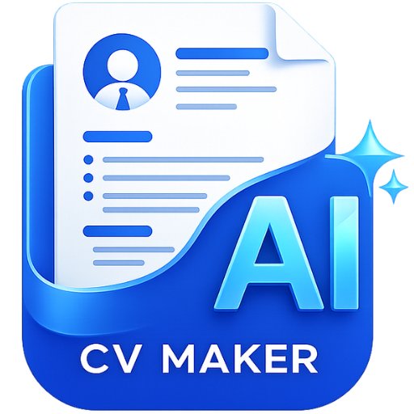

<div align="center">
  
  <h1>✨ AI CV Maker</h1>
  <p><strong>Aplikasi Pembuat CV Cerdas Berbasis Artificial Intelligence</strong></p>

  [](https://github.com/ArilSyahril11/ai-cv-maker)
  [](#)
  [](LICENSE)
</div>

<hr />

## 📖 Tentang Aplikasi

**AI CV Maker** adalah aplikasi profesional lintas platform (Desktop & Mobile) yang dirancang untuk membantu Anda membuat *Curriculum Vitae* (CV) dengan cepat dan menarik. Terintegrasi dengan kecerdasan buatan (AI) dari **Google Gemini API**, aplikasi ini tidak hanya memformat CV Anda, tetapi juga membantu memoles deskripsi pengalaman dan keahlian Anda menjadi lebih profesional dan memikat HRD.

Dikembangkan oleh **Syahril Azhar Ramdhanu**.

---

## 🚀 Fitur Unggulan

- 🤖 **AI Text Polishing:** Poles otomatis deskripsi pengalaman kerja dan ringkasan profil menggunakan Gemini AI.
- 🎨 **Kustomisasi Desain:** Atur margin, ukuran teks, jarak baris, warna aksen, hingga jenis *font* langsung dari dalam aplikasi.
- 🖼️ **Editor Foto Bawaan:** Potong (crop), putar, dan ubah bingkai foto (kotak atau bulat) secara langsung.
- 💾 **Sistem Penyimpanan Cerdas (.cvm):** Simpan draf CV Anda dalam format `.cvm` dan impor kembali kapan saja di perangkat mana saja (Desktop & Android).
- 📄 **Export to PDF:** Cetak dan bagikan CV Anda ke dalam format PDF resolusi tinggi siap lamar.
- 🔄 **Auto-Updater Terintegrasi:** Mendukung pembaruan otomatis (Auto-Update) melalui GitHub Releases untuk Desktop dan Android.

---

## 💻 Panduan Instalasi (Desktop Windows)

Aplikasi Desktop dibangun menggunakan arsitektur **Electron** yang ringan dan gegas.

**Prasyarat:** [Node.js](https://nodejs.org/) (v18 atau lebih baru)

1. **Persiapan API Key:**
   Buat file `.env` di direktori utama (satu level di atas folder `desktop/`) dan masukkan Google Gemini API Key Anda:
   ```env
   GEMINI_API_KEY=KODE_API_ANDA_DI_SINI
   ```

2. **Instalasi Dependensi:**
   Buka terminal, masuk ke folder `desktop/`, lalu jalankan:
   ```bash
   cd desktop
   npm install
   ```

3. **Jalankan Aplikasi Mode Development:**
   ```bash
   npm start
   ```

4. **Kompilasi menjadi Aplikasi `.exe` (Installer):**
   ```bash
   npm run build
   ```
   *File installer akan tersedia di folder `desktop/dist/`.*

---

## 📱 Panduan Instalasi (Mobile Android)

Aplikasi Mobile dibangun murni menggunakan **Jetpack Compose** untuk performa Native terbaik.

**Prasyarat:** [Android Studio](https://developer.android.com/studio)

1. Buka folder proyek ini menggunakan **Android Studio**.
2. Pastikan file `.env` sudah berada di root direktori proyek dengan isi `GEMINI_API_KEY` Anda.
3. Tunggu hingga proses sinkronisasi Gradle selesai.
4. Hubungkan *smartphone* Android Anda atau gunakan Emulator, lalu klik tombol **Run** (Segitiga Hijau) di atas.

---

## ☁️ Sistem Pembaruan Otomatis (Auto-Updater)

Aplikasi ini dilengkapi dengan fitur OTA (*Over-the-Air*) *updates* yang otomatis melacak rilis terbaru dari repositori GitHub ini.
* **Desktop:** Menggunakan `electron-updater` untuk mengunduh dan memasang *patch* di latar belakang.
* **Mobile:** Menggunakan `DownloadManager` dan GitHub REST API untuk mengunduh versi `.apk` terbaru secara langsung dari dalam aplikasi.

---

## 👨‍💻 Pengembang

Dikembangkan dengan dedikasi penuh oleh:
- **Nama:** Syahril Azhar Ramdhanu
- **Email:** aril.syahril149@gmail.com
- **GitHub:** [ArilSyahril11](https://github.com/ArilSyahril11)

---
<div align="center">
  <p><i>© 2026 Syahril Azhar Ramdhanu. Hak Cipta Dilindungi Undang-Undang.</i></p>
  <p><i>Powered by Google Gemini AI</i></p>
</div>
